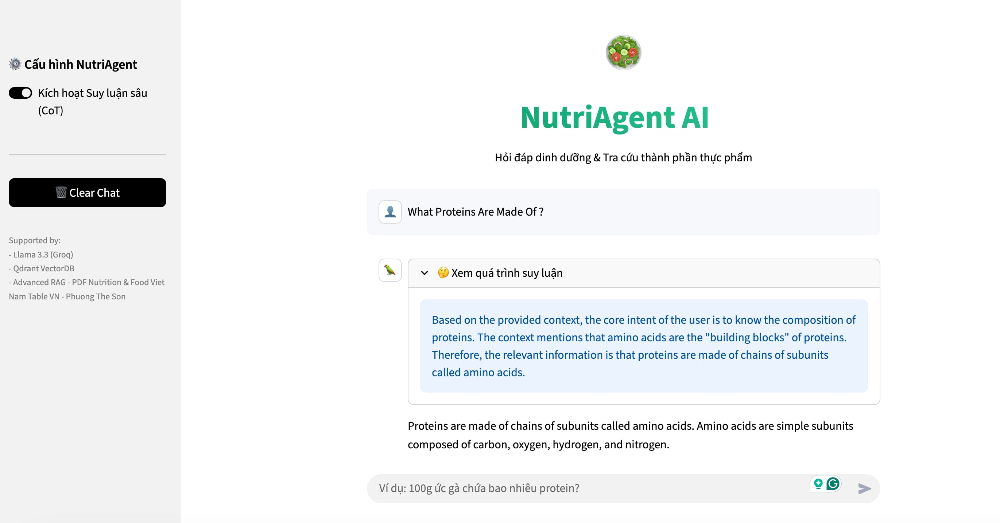

<h1 align="center">
  
</h1>

<div align="center">


</div>

<p align="center">
  <b>AI Agent NutriRAG</b> là hệ thống <b>Agentic RAG</b> chuyên sâu về dinh dưỡng, kết hợp khả năng suy luận chuỗi (Chain-of-Thought) của LLM tốc độ cao (Groq) với dữ liệu chuẩn y khoa.
</p>

---

## Demo giao diện chat (UI-Chat)
<div align="center">
  
  <p><i>Giao diện Chatbot với khả năng hiển thị quá trình suy luận (Chain-of-Thought)</i></p>
</div>

---

## 🌟 Tính Năng Nổi Bật

- **Hyper-Fast Inference:** Sử dụng **Groq LPU** giúp giảm độ trễ phản hồi xuống mức mili-giây.
- **Chain-of-Thought Agent:** AI thực hiện quy trình suy luận từng bước (Reasoning) để tính toán khẩu phần ăn cá nhân hóa.
- **Hybrid Knowledge Base:** Xử lý đa dạng dữ liệu:
    - *Phi cấu trúc:* Sách giáo khoa tiếng Anh (Textbook).
    - *Có cấu trúc:* Bảng thành phần thực phẩm Việt Nam (Table).
- **Auto-Healing Data:** Tự động phát hiện và sửa lỗi encoding/font chữ tiếng Việt trong quá trình nạp dữ liệu.
- **Ragas Evaluation:** Tích hợp pipeline đánh giá chất lượng RAG tự động.

---

##  Kiến Trúc Hệ Thống & Cấu Trúc Thư Mục

Dự án được tổ chức theo mô hình Modular để dễ dàng mở rộng:

```text
AI_AGENT_NUTRIRAG/
├── .streamlit/          # Cấu hình giao diện Streamlit
├── data/                # Kho dữ liệu
│   ├── cache_parse/     # Dữ liệu đã parse (Pickle files)
│   ├── qdrant_db/       # Local Vector Database storage
│   └── *.pdf            # Tài liệu gốc (Tiếng Việt & Tiếng Anh)
├── src/                 # Mã nguồn chính
│   ├── cores/           # Logic lõi của Agent
│   │   ├── CoT_agent.py # Agent suy luận tư duy chuỗi
│   │   └── prompts.py   # Các template prompts tối ưu
│   ├── processing/      # Parsing and Chunking
│   ├── vectordb/        # Kết nối và truy vấn Qdrant
│   ├── utils/           # Các hàm hỗ trợ chung
│   ├── evaluation.py    # Script chấm điểm RAG bằng Ragas
│   └── run_pipeline.py  # Script chạy quy trình nạp dữ liệu
├── app.py               # Main Application (Streamlit)
├── pyproject.toml       # Cấu hình project
├── uv.lock              # Lockfile quản lý version chặt chẽ
└── .env                 # Biến môi trường (API Keys)
```

## Yêu Cầu Cài Đặt

Trước khi bắt đầu, hãy đảm bảo máy tính của bạn đáp ứng các yêu cầu sau:

* **Hệ điều hành:** MacOS, Linux hoặc Windows (WSL2 được khuyến khích).
* **Python:** Phiên bản từ `3.10` đến dưới `3.13`.
* **Git:** Để quản lý mã nguồn.

---

## Hướng Dẫn Cài Đặt

Bạn có thể chọn một trong hai cách cài đặt dưới đây tùy theo sở thích quản lý môi trường của mình.

### Cách 1: Sử dụng `uv` (Khuyên dùng - Tốc độ cao)

Dự án này được tối ưu hóa để sử dụng với **uv** - trình quản lý gói Python thế hệ mới, giúp cài đặt dependencies nhanh hơn 10-100 lần so với pip.

**1. Cài đặt `uv` (nếu chưa có):**

* **MacOS / Linux:**
    ```bash
    curl -LsSf [https://astral.sh/uv/install.sh](https://astral.sh/uv/install.sh) | sh
    ```
* **Windows:**
    ```powershell
    powershell -c "irm [https://astral.sh/uv/install.ps1](https://astral.sh/uv/install.ps1) | iex"
    ```

**2. Cài đặt dependencies dự án:**

Tại thư mục gốc của dự án, chạy lệnh sau. `uv` sẽ tự động tạo môi trường ảo (.venv) và cài đặt tất cả thư viện cần thiết từ file `uv.lock`.

```bash
uv sync
```
**2. Sử dụng pip (Truyền thống)**

Nếu bạn không muốn sử dụng uv hoặc môi trường ảo, bạn có thể cài đặt trực tiếp thông qua pip tiêu chuẩn.

**Lưu ý: Cách này có thể gây xung đột phiên bản với các dự án Python khác trên máy của bạn**

```bash
pip install -r requirements.txt
```

## Cấu Hình Biến Môi Trường

Dự án sử dụng nhiều mô hình AI khác nhau (Groq, LlamaParse,...). Bạn cần tạo file .env tại thư mục gốc và điền các API Key tương ứng:

### Tạo file .env và điền các thông tin sau:
```text
OPENAI_API_KEY=sk-...
GOOGLE_API_KEY=AIza...          
GROQ_API_KEY=gsk_...            
HUGGINGFACEHUB_API_TOKEN=hf_... 
LLAMA_CLOUD_API_KEY=llx-...    
QDRANT_URL=http://localhost:6333
QDRANT_API_KEY=                 
LANGCHAIN_TRACING_V2=true
```

## Hướng Dẫn Vận hành

Để chạy hệ thống, bạn thực hiện lần lượt 2 bước sau:

Bước 1: Nạp dữ liệu (Ingestion)
Chạy lệnh này để quét file PDF, xử lý lỗi font, tạo cache và đẩy vào Vector DB.

```bash
uv run python -m src.run_pipeline
```

Bước 2: Chạy Ứng dụng (Web App)
Sau khi Bước 1 hoàn tất, chạy lệnh này để mở giao diện Chatbot.

```bash
uv run python -m streamlit run app.py
```

(Tùy chọn) Chạy Đánh giá (Evaluation)
Chạy lệnh này để chấm điểm độ chính xác của RAG.

```bash
uv run python -m src.evaluation
```

---

## 🗺️ Roadmap (Kế hoạch phát triển)

- [x] Xây dựng RAG Pipeline cơ bản với LlamaIndex & LangChain.
- [x] Tích hợp Agentic Workflow (Chain-of-Thought) để tư vấn chuyên sâu.
- [x] Tối ưu hóa Vector DB (Qdrant) và Caching.
- [x] Đánh giá hiệu suất với Ragas Framework.
- [ ] **Next:** Triển khai (Deploy) lên Docker/Cloud.
- [ ] **Next:** Bổ sung thêm dữ liệu hình ảnh món ăn (Multimodal RAG).

---

## 📜 License
Dự án được phân phối dưới giấy phép **MIT License**. Xem file [LICENSE](LICENSE) để biết thêm chi tiết.
